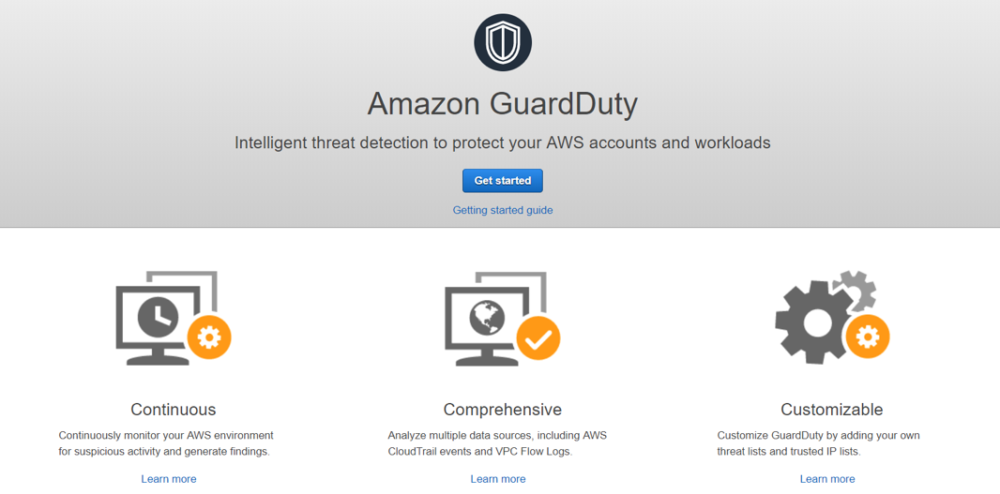
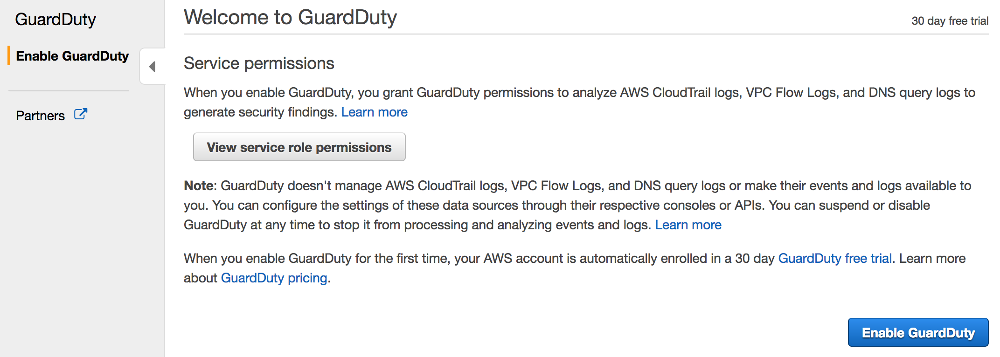
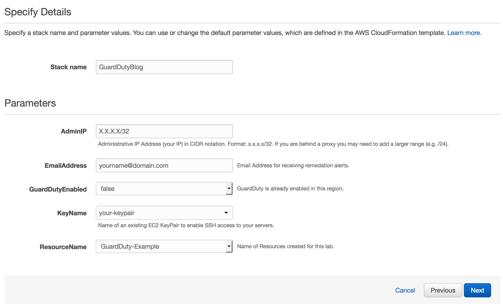
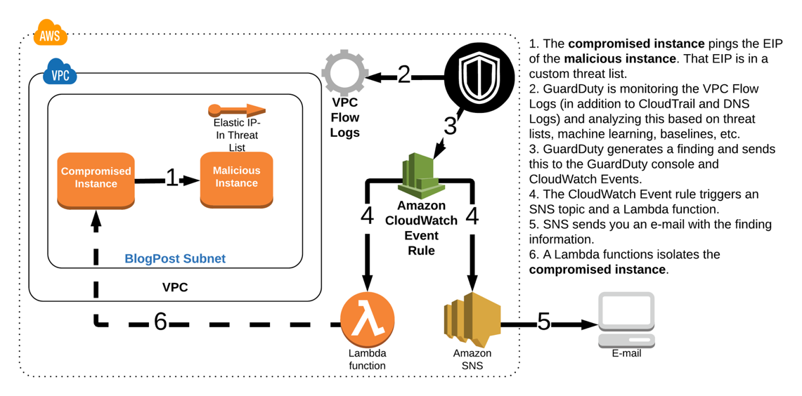
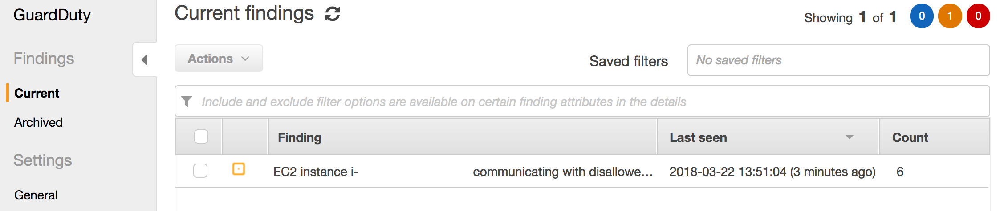
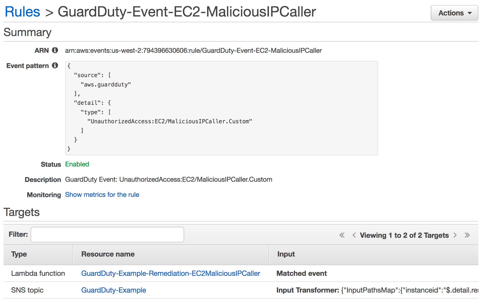
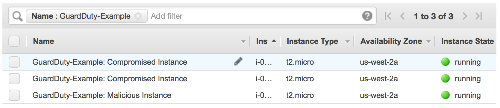
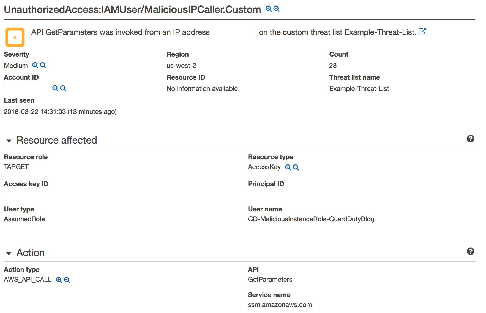

# Getting Hands on with Amazon GuardDuty

This repository walks you through a scenario covering threat detection and remediation using [Amazon GuardDuty](https://aws.amazon.com/guardduty/); a managed threat detection service. The scenario simulates an attack that spans a few threat vectors, representing just a small sample of the threats that GuardDuty is able to detect. In addition, you will look at how to view and analyze GuardDuty findings, how to send alerts based on the findings, and, finally, how to remediate findings. The [AWS CloudFormation](https://aws.amazon.com/cloudformation/) template used for this scenario builds out the resources needed to simulate attacks and auto-remediate the GuardDuty findings using a combination of [CloudWatch Event Rules](https://docs.aws.amazon.com/AmazonCloudWatch/latest/events/WhatIsCloudWatchEvents.html) and [AWS Lambda Functions](https://aws.amazon.com/lambda/).  

### Prerequisites

* **AWS Account**: Given that you will be simulating attacks and doing remediations, you should run this in a non-production account. After running through these scenarios, you can look at how you can implement GuardDuty and associated automated remediation workflows in a multi-account structure so you are able to aggregate findings from other accounts and use the service in a more productionized manner. 
* **Admin Privileges**: Ensure you are using an AWS IAM User with Admin privileges.
* **AWS CLI**: You will be using the AWS CLI for simulating one of the attacks so be sure you have installed on your local machine.

### Table of Contents

* [Getting Started](#started) 
* [Deploy the Environment](#deploy) 
* [Scenario 1 – Compromised EC2 Instance](#attack1) 
* [Scenario 2 – Compromised IAM Credentials](#attack2)
* [Scenario 3 – IAM Role Credential Exfiltration](#attack3)
* [Summary](#summary)
* [Clean Up](#cleanup)

> All of the links assume you are using the **us-west-2 (Oregon)** region.

## Getting Started – Just Two Clicks <a name="started"/>

Follow these steps to enable GuardDuty:

1. **First Click**: Navigate to the [GuardDuty console](https://us-west-2.console.aws.amazon.com/guardduty/home?) and click **Get Started**.



2. **Second Click**: On the next screen click **Enable GuardDuty**.



### Data Sources

That is all you need to do. There are no prerequisites you need to set up, no agents to install, and no hardware to configure. From the moment you enable GuardDuty it begins analyzing all of the VPC Flow Logs, CloudTrail logs, and DNS Logs in that region. DNS Logs are generated from the default AWS DNS resolvers used for your VPCs and are not an available data source to customers.  

> If you are using a 3rd party DNS resolver or if you set up your own DNS resolvers, then GuardDuty cannot access, process, and identify threats from that data source. 

GuardDuty accesses all of these [data sources](https://docs.aws.amazon.com/guardduty/latest/ug/guardduty_data-sources.html) without any of them having to be enabled; although it is a best practice to enable CloudTrail and VPC Flow Logs for your own analysis. GuardDuty is a regional service so in order for the service to monitor these data sources in other regions you will need to enable it in those regions.  You can accomplish this by following the same steps above and enabling it through the console but most customers are using the APIs to programmatically enable it in all regions and across multiple accounts.  Regardless of the number of VPCs, IAM users, or other AWS resources in your account, there is no impact to your resources because all of the processing is being done within the managed service. 

> The pricing for GuardDuty is based on the quantity of AWS CloudTrail Events analyzed and the volume of Amazon VPC Flow Log and DNS Log data analyzed (per GB).  Each region in an AWS Account has a free 30-day trial to better forecast what the cost of the service will be.


### Findings

Now that GuardDuty is enabled it is actively monitoring the three data sources for malicious or unauthorized behavior as it relates to your EC2 instances and AWS IAM Principals.  You should be taken directly to the **Findings** tab which will show finding details as GuardDuty detects them. After deploying the scenario, you will start to see GuardDuty findings being detected.  Each finding is broken down into the following format to allow for a concise yet readable description of potential security issues.

**ThreatPurpose : ResourceTypeAffected / ThreatFamilyName . ThreatFamilyVariant ! Artifact**

> Click [here](https://docs.aws.amazon.com/guardduty/latest/ug/guardduty_finding-types.html#type-format) for a description of each part.

The more advanced behavioral and machine learning detections require a baseline (7 - 14 days) to be established so GuardDuty is able to learn the regular behavior and identity anomalies. An example of a finding that requires a baseline would be if an EC2 instance started communicating with a remote host on an unusual port or an IAM User who has no prior history of modifying Route Tables starts making modifications.  All of the findings generated in these scenarios will be based on signatures, so the findings will be detected 10 minutes after the completion of the CloudFormation stack.  The delay is due to the amount of time it takes for the information about a threat to appear in one of the data sources and the amount of time it takes for GuardDuty to access and analyze that particular data source.  

> Click [here](https://docs.aws.amazon.com/guardduty/latest/ug/guardduty_finding-types.html#actual-types) for a complete list of current GuardDuty finding types. 

GuardDuty sends notifications based on Amazon CloudWatch Events when any change in the findings takes place. These notifications are sent within 5 minutes of the finding. All subsequent occurrences of an existing finding will have the same ID as the original finding and notifications will be sent every 6 hours after the initial notification.  This is to eliminate alert fatigue due to the same finding.

## Deploy the Environment <a name="deploy"/>

To initiate the scenarios and begin generating GuardDuty findings run the provided CloudFormation template.

Region| Deploy
------|-----
US West 2 (Oregon) | [](https://console.aws.amazon.com/cloudformation/home?region=us-west-2#/stacks/new?stackName=GuardDuty-Hands-On&templateURL=https://s3-us-west-2.amazonaws.com/sa-security-specialist-workshops-us-west-2/guardduty-hands-on/guardduty-cfn-template.yml)

1.  Click the **Deploy to AWS** button above.  This will automatically take you to the AWS Management Console to run the template.  If you prefer, you can also just use the template found in this repo (guardduty-cfn-template.yml).
2.  On the **Specify Details** section enter the necessary parameters as shown below. 
    
3.  Once you have entered your parameters click **Next**, then **Next** again \(leave everything on this page at the default\).
4.  Finally, acknowledge the template will create IAM roles and click **Create**.  This will bring you back to the CloudFormation console. You can refresh the page to see the stack starting to create.
5.  You will get an email from SNS asking you to confirm the Subscription. Confirm this so you can receive email alerts from GuardDuty.

The initial findings will begin to show up in GuardDuty 10 minutes after the CloudFormation stack creation completes. 

### What is Created?

The CloudFormation template will create the following resources:
  * Three [Amazon EC2](https://aws.amazon.com/ec2/) Instances (and supporting network infrastructure)
    * Two Instances that contain the name “*Compromised Instance*”
    * One instance that contains the name “*Malicious Instance*”
  * [AWS IAM Role](https://docs.aws.amazon.com/IAM/latest/UserGuide/id_roles.html) For EC2 which will have permissions to SSM Parameter Store and DynamoDB
  * One [Amazon SNS Topic](https://docs.aws.amazon.com/sns/latest/dg/GettingStarted.html) so you will be able to receive notifications
  * Three [AWS CloudWatch Event](https://docs.aws.amazon.com/AmazonCloudWatch/latest/events/WhatIsCloudWatchEvents.html) rules for triggering the appropriate notification or remediation
  * Two [AWS Lambda](https://aws.amazon.com/lambda/) functions that will be used for remediating findings and will have permissions to modify Security Groups and revoke active IAM Role sessions (on only the IAM Role associated with this scenario)
  * [AWS Systems Manager Parameter Store](https://docs.aws.amazon.com/systems-manager/latest/userguide/systems-manager-paramstore.html) value for storing a fake database password.

> Make sure the CloudFormation stack is in a **CREATE_COMPLETE** status before moving on.

### Generate Finding Manually

All of the simulated attacks are automated in the CloudFormation template except for one; which requires you to take some manual steps.  To produce the final finding, you will need to copy the IAM temporary security credentials from the EC2 instance and make API calls from your laptop (the calls need to come from outside the AWS network). 

#### Retrieve the IAM Temporary Security Credentials using Systems Manager

To simulate this last and final attack you will need to retrieve the IAM temporary security credentials generated by the IAM Role for EC2. You can either SSH directly to the instance and query the metadata or follow the steps below to use [AWS Systems Manager Run Command](https://docs.aws.amazon.com/systems-manager/latest/userguide/execute-remote-commands.html) (an SSM agent was automatically started on the instance at launch). 

1.  Go to [Managed Instances](https://us-west-2.console.aws.amazon.com/systems-manager/managed-instances?region=us-west-2) within the **AWS Systems Manager** console.
    
    > You should see an instance named **GuardDuty-Example: Compromised Instance: Scenario 3** with a ping status of **Online**.
2.  To see the keys currently active on the instance, click on **Run Command** on the left navigation.
3.  Click **Run a command**.
4.  For **Command Document** select **AWS-RunShellScript**.
5.  Under **Targets** check the checkbox next to **GuardDuty-Example: Compromised Instance: Scenario 3**.
6.  Under **Command Parameters** type the following in **Commands**:

    ```
    curl http://169.254.169.254/latest/meta-data/iam/security-credentials/GuardDuty-Example-EC2-Compromised
    ```

7.  Click **Run**.
8.  Back at the Run Command console, click on the **Command ID** of the command you just ran to see the details.
9.  Scroll down to **Targets and Outputs** and click on the **Instance ID**.
10. Expand **Step 1 - Output** and make note of the **AccessKeyID**, **SecretAccessKey**, and **Token**.

### Create a new AWS CLI profile on your laptop to use the IAM temporary credentials 

Now that you have retrieved the IAM temporary security credentials you will need to add them to an AWS CLI profile. There are a number of ways to do this, but below are some commands to help get you started:

From a command prompt, run the following commands (replace the variables with your credentials):
```
aws configure set profile.attacker.region us-west-2
aws configure set profile.attacker.aws_access_key_id <access_key>
aws configure set profile.attacker.aws_secret_access_key <secret_key>
aws configure set profile.attacker.aws_session_token <session_token>
```

If you view your local aws credentials file, you should now see an [attacker] profile with the stolen IAM temporary credentials.

### Run commands using the IAM temporary credentials

Now that you have your named profile you can use it to make API calls. Use the commands below to query different services to see what you have access to (don't be surprised if you see some access denied responses):

**Do you have any IAM permissions:**
```
aws iam get-user --profile attacker

aws iam create-user --user-name Chuck --profile attacker
```

**What about DynamoDB?**
```
aws dynamodb list-tables --profile attacker

aws dynamodb describe-table --table-name GuardDuty-Example-Customer-DB --profile attacker
```

**Can you query the data?**
```
aws dynamodb scan --table-name GuardDuty-Example-Customer-DB --profile attacker

aws dynamodb put-item --table-name GuardDuty-Example-Customer-DB --item '{"name":{"S":"Joshua Tree"},"state":{"S":"Michigan"},"website":{"S":"https://www.nps.gov/yell/index.htm"}}' --profile attacker

aws dynamodb scan --table-name GuardDuty-Example-Customer-DB --profile attacker

aws dynamodb delete-table --table-name GuardDuty-Example-Customer-DB --profile attacker

aws dynamodb list-tables --profile attacker
```

**Do you have access to Systems Manager Parameter Store?**
```
aws ssm describe-parameters --profile attacker

aws ssm get-parameters --names "gd_prod_dbpwd_sample" --profile attacker

aws ssm get-parameters --names "gd_prod_dbpwd_sample" --with-decryption --profile attacker

aws ssm delete-parameter --name "gd_prod_dbpwd_sample" --profile attacker
```

## Scenario 1 – Compromised EC2 Instance <a name="attack1"/>

You are simulating a detection scenario so let’s set the scene: 

### Scene Simulation

After an uneventful yet unnecessarily long commute to work, you arrived at the office on Monday morning. You grabbed a cup of coffee, sat down in your cube, opened up your laptop and begin to go through your emails. Soon after you begin though you start receiving emails indicating that GuardDuty has detected new threats. You don’t yet know the extent of the threats but you quickly begin to investigate. Now the good news is that your coworker Alice has already set up some hooks for specific findings so that they will be automatically remediated. 

The first email you receive from GuardDuty indicates that one of your EC2 instances might be compromised:

*GuardDuty Finding | ID: 1xx: The EC2 instance i-xxxxxxxxx might be compromised and should be investigated*

Shortly after the first email, you receive a second email indicating that the same GuardDuty finding has been remediated:

*GuardDuty Remediation | ID: 1xx: GuardDuty discovered an EC2 instance (Instance ID: i-xxx) that is communicating outbound with an IP Address on a threat list that you uploaded.  All security groups have been removed and it has been isolated. Please follow up with any additional remediation actions.*

### Diagram of the Attack, Detection, and Remediation



When Alice setup the hook for notifications she only included certain information about the finding because she had also setup a Lambda function to automatically isolate the instance and send out the details of the remediation.  Since the finding has been remediated you decide you still want to take a closer look at the setup Alice currently has in place.

### Browse to the GuardDuty Console to Investigate

> Although you can view the GuardDuty findings in the console, most customers aggregate all findings across their regions and accounts to a central security information and event management (SIEM) system for analysis and remediation.  A common approach for aggregating these findings is to setup GuardDuty in a [Master/Member](https://docs.aws.amazon.com/guardduty/latest/ug/guardduty_accounts.html) structure and then use a workflow including CloudWatch Event Rules and Lambda Functions to push findings to your SIEM or a centralized logging framework.  There are also partner solutions that publish Lambda Function Blueprints to make it easier to consolidate findings.

1. Navigate to the [GuardDuty console](https://us-west-2.console.aws.amazon.com/guardduty/home?).
   
>	If there is nothing displayed click the refresh button.

2. A finding should show up with the type **UnauthorizedAccess:EC2/MaliciousIPCaller.Custom**. 
	
>	Based on the format you reviewed earlier can you determine the security issue by the finding type?



The quick view of the finding shows a severity symbol, the finding type, the affected resource, the last time the finding was detected, and a count of the subsequent occurrences of an existing finding.  

> Findings are available in the service for 90 days.

The finding type indicates that an EC2 instance in your environment is communicating outbound to an IP address included on a [custom threat list](https://docs.aws.amazon.com/guardduty/latest/ug/guardduty_upload_lists.html). Click on **Lists** in the left navigation to view the custom threat list Alice added.

> GuardDuty uses managed threat intelligence provided by AWS Security and third-party providers, such as ProofPoint and CrowdStike. You can expand the monitoring scope of GuardDuty by configuring it to use your own custom trusted IP lists and threat lists.  If you setup a Master/Member GuardDuty structure, users from the Master GuardDuty account can manage trusted IP lists and threats lists and they are inherited by the member accounts.  Users from the member accounts are not able to modify the lists.  

**Scenario Notes:** 
* The EC2 instance indicated by this finding is actually just connecting to an [Elastic IP](https://docs.aws.amazon.com/AWSEC2/latest/UserGuide/elastic-ip-addresses-eip.html) (EIP) on another instance in the same VPC to keep the scenario localized to your environment. The CloudFormation template automatically created the threat list and added the EIP for the malicious instance to the list.

### View the CloudWatch Event Rule
  
Alice used CloudWatch Event Rules to send the email you received about the findings and also to take remediations steps. Examine the CloudWatch Events console to understand what Alice configured and to see how the remediation was triggered. 

1.  Navigate to the [CloudWatch console](https://us-west-2.console.aws.amazon.com/cloudwatch/home?) and on the left navigation, under the **Events** section, click **Rules**. 

    > You will see three Rules in the list that were created by the CloudFormation template. All of these begin with the prefix “*GuardDuty-Event*."

	

2.	Click on the rule named **GuardDuty-Event-EC2-MaliciousIPCaller**. 

	

	Under the **Targets** section you will see two entries, one for a Lambda function and one for an SNS Topic.  The CloudWatch Event Rule publishes the finding to the SNS Topic which in turn sends out an email notification.  Rather than sending the entire JSON event you can see how Alice customized the email by using an **[input transformer](https://docs.aws.amazon.com/AmazonCloudWatch/latest/events/CloudWatch-Events-Input-Transformer-Tutorial.html)**.

### View the Remediation Lambda Function

The Lambda function is what handles the remediation logic for this finding. Alice setup the Lambda function to remove the compromised instance from its current security group and add it to one with no ingress or egress rules so that the instance is isolated from the network. Click the **Resource Name** for the Lambda function in the Targets section to evaluate the remediation logic.


Scroll down to view the code for this function (walking through the code logic is outside the scope of this scenario). You can also click the **Monitoring** tab and view the invocation details for this function. 

> What permissions does the Lambda Function need to perform the remediation?

### Verify that the Remediation was Successful

Next, double check the effects of the remediation to ensure the instance is isolated.  At this point you have the instance ID of the compromised instance from the email notifications and the name of the isolation security group name from reviewing the Lambda Function code.

1.	Browse to the [EC2 console](https://us-west-2.console.aws.amazon.com/ec2/v2) and click **Running Instances**.
   
    > You should see three instances with names that begin with **GuardDuty-Example**.

    
2.  Click on the instance with the instance ID you saw in the GuardDuty finding or email notifications.

    > **GuardDuty-Example: Compromised Instance: Scenario 1**.  

3.  After reviewing the remediation Lambda Function you know that the instance should now have the Security Group with a name that includes **ForensicSecurityGroup**.  Under the **Description** tab verify the instance has this security group.

    > Initially, all three of the instances launched by the CloudFormation template were in the Security Group with a name that includes **TargetSecurityGroup**. The Lambda function removed the TargetSecurityGroup from the instance and added the ForensicsSecurityGroup to isolate the instance. 

4. Click on the **ForensicSecurityGroup** and view the ingress and egress rules.

### Questions
* Which data source did GuardDuty use to identity this threat?
* Will isolating the instance have any effect on an application running on the instance?
* How could you add more detail to the email notifications?

## Scenario 2 – Compromised IAM Credentials (Simulated) <a name="attack2"/>

You have completed the examination of the first attack, confirmed it was properly remediated, and then sat back to take your first sip of coffee for the day when you notice an additional email about new findings. The first of the new findings indicates that an API call was made using AWS IAM credentials from an IP address on a custom threat list. 

**Scenario Note**: 
* None of your IAM credentials have actually been compromised or exposed in any way. The finding is the result of an EC2 instance using an IAM Users credentials to make API calls and the EIP for the instance is on your custom threat list.

### Diagram of the Simulated Attack and Detection


### Browse to the GuardDuty Console to Investigate

To view the findings:

1.  Navigate to the [GuardDuty console](https://us-west-2.console.aws.amazon.com/guardduty/home?). 
2.  Click the   icon to refresh the GuardDuty console. You should now see additional findings that are related to **Recon:IAMUser** and **UnauthorizedAccess:IAMUser**. 

>	Based on the format you reviewed earlier can you determine the security issues by the finding type?

3.  Click on the **UnauthorizedAccess:IAMUser/MaliciousIPCaller.Custom** finding to view the full details. 



You can see the finding details include information about what happened, what AWS resources were involved in the suspicious activity, when this activity took place, and other additional information.  Under **Resource Affected**, find the **User Name** associated with this finding.

This finding indicates that the IAM credentials (of the user you found above) are possibly compromised because API calls using those credentials are being made from an IP address on a custom threat list.

> What actions did this AWS IAM User take? You can see under **Action** and then **API** that a **GetParameters** API call was made but how can you view the rest of the actions made by this user over the past hour or day?  GuardDuty is able to analyze large volumes of data and identity true threats in your environment but from an investigation and remediation stand point it is still important to correlate other data to understand the full scope of the threat.  In this case an analyst would use the details in this finding to pinpoint historical user activity in CloudTrail.

**Scenario Note**: 
* These IAM findings are being generated by the “malicious EC2” instance making API calls. These API calls generate findings because the EIP of that instance is in a custom threat list.

### View the CloudWatch Event Rule

1.	Navigate to the [CloudWatch console](https://us-west-2.console.aws.amazon.com/cloudwatch/home?) and on the left navigation, under the **Events** section, click **Rules**.
2.	Click on the rule that Alice configured for this particular finding (**GuardDuty-Event-IAM-MaliciousIPCaller**). 
3.	Under the **Targets** section, you will see a rule for an SNS Topic. Turns out Alice did not set up a Lambda function to remediate this threat because the decision by the security team was to manually investigate and remediate this particular type of finding. 

> Since GuardDuty integrates with CloudWatch Events you have the flexibility to put in place full or partial automated remediation workflows.  These could be custom Lambda Functions that you build out or maybe even [partner](https://aws.amazon.com/guardduty/resources/partners/) solutions.  You can also configure other AWS Resources as targets in your CloudWatch Event Rules such as SSM Run Commands or Step Functions state machines. For some finding types you may choose to have only notification workflows and require manual remediation steps. As you design these workflows it is important to evaluate the workloads running in your environments to see what effects a remediation could have.

### Manually Remediate the Finding

Since Alice did not setup a remediation for this finding, you have to manually remediate this.  While the security team is analyzing the previous activity of this user to better understand the scope of the compromise, you need to disable the access key associated with the user to prevent any more unauthorized actions.

1.  Browse to the [AWS IAM](https://console.aws.amazon.com/iam/home?region=us-west-2) console.
2.  Click **Users** in the left navigation.
3.  Click on the user you identified in the GuardDuty finding and email notifications (**GuardDuty-Example-Compromised-Simulated**).
4.  Click the **Security Credentials** tab.
5.  Under **Access Keys**, find the Access Key ID you identified in the finding and click **Make Inactive**. 

### Questions
* Which data source did GuardDuty use to identity this threat?
* What permissions did the user have?
* Why would the security team decide against setting up an automated remediation?

## Scenario 3 – IAM Role Credential Exfiltration <a name="attack3"/> 

After manually remediating the previous GuardDuty finding, you have finally finished your first cup of coffee when another email notification comes in alerting you to yet another finding.  The initial email comes in and then a minute or so later you see the remediation email, meaning Alice had already put in place a remediation for this finding.  The other findings you looked at dealt with EC2 instances and AWS IAM credentials separately, but this finding appears to be related to an AWS IAM Role associated with an EC2 instance.  You decide to take a closer look at the finding and remediation.

**Scenario Note**: 
* None of your IAM credentials have actually been compromised or exposed in any way. The finding was triggered when you used AWS Systems Manager for accessing the temporary security credentials of the EC2 instance and then ran a number of CLI commands locally from your computer.

### Browse to the GuardDuty Console to Investigate

To view the findings:

1.  Navigate to the [GuardDuty console](https://us-west-2.console.aws.amazon.com/guardduty/home?) and then, in the navigation pane on the left, choose **Current**. 
2.  Click the   icon to refresh the GuardDuty console. You should see a finding with the type **UnauthorizedAccess:IAMUser/InstanceCredentialExfiltration**. 

3.  Click on the **UnauthorizedAccess:IAMUser/InstanceCredentialExfiltration** finding to view the full details. 

Looking at the finding details you can see that this is actually a **High Severity** finding.  This finding informs you of attempts to run AWS API operations from a host outside of EC2, using temporary AWS credentials that were created on an EC2 instance in your AWS account.  This means your EC2 instance has been compromised, and the temporary credentials from the instance have been exfiltrated to a remote host outside of AWS.

> You will notice that each GuardDuty finding has an assigned severity level and value (low, medium, or high) that can help you determine your response to a potential security issue that is highlighted by the finding.  These severity levels are preset by AWS but we have seen customers modify these values in their automation workflows to better align the risk of that finding in the context of their environment and requirements.

### View the CloudWatch Event Rule

1.	Navigate to the [CloudWatch console](https://us-west-2.console.aws.amazon.com/cloudwatch/home?) and on the left navigation, under the **Events** section, click **Rules**.
2.	Click on the rule that Alice configured for this particular finding (**GuardDuty-Event-IAMUser-InstanceCredentialExfiltration**). 

Take a closer look at the **Event Pattern**.  The pattern Alice setup for all the rules specifies particular findings.  

> Like Alice, you can create CloudWatch Event Rules that are triggered for particular findings but you can also create a rule that is triggered based on any GuardDuty finding in order to have a centralized workflow.  Below is an example of an Event Pattern that would trigger for any GuardDuty finding:

```
{
  "detail-type": [
    "GuardDuty Finding"
  ],
  "source": [
    "aws.guardduty"
  ]
}
```

### View the Remediation Lambda Function

Alice also set up a remediation for this threat. Look through the Lambda Function code to better understand the remediation.

Go to the [Lambda console](https://us-west-2.console.aws.amazon.com/lambda/home?) and review the function named **GuardDuty-Example-Remediation-InstanceCredentialExfiltration**.

The Lambda Function retrieves the Role name from the finding details and then attaches an IAM policy that revokes all active sessions for the role.

> What permissions does the Lambda Function need to perform the remediation?  Is there a risk associated with this level of permissions?

### Verify that the Remediation was Successful

To verify that the **InstanceCredentialExfiltration** finding was remediated, you can run one of the CLI commands you ran earlier.

```
aws dynamodb list-tables --profile attacker
```

You should see a response that states that there is an explicit deny for that action. Go view the Role to evaluate the policy that was attached.

1.  Browse to the [AWS IAM](https://console.aws.amazon.com/iam/home?region=us-west-2) console.
2.  Click **Roles** in the left navigation.
3.  Click on the Role you identified in the GuardDuty finding and email notifications (**GuardDuty-Example-EC2-Compromised**).
4.  Click the **Permissions** tab.
5.  Click on the **RevokeOldSessions** Policy.

### Questions
* What are the risks involved with this remediation?
* What other EC2 instances are using this Role?

## Summary <a name="summary"/>

By walking through these scenarios you generated, analyzed, and remediated all of the following threats in your environment:
* [UnauthorizedAccess:EC2/MaliciousIPCaller.Custom](https://docs.aws.amazon.com/guardduty/latest/ug/guardduty_finding-types.html#unauthorized8)
* [Recon:IAMUser/MaliciousIPCaller.Custom](https://docs.aws.amazon.com/guardduty/latest/ug/guardduty_finding-types.html#recon2)
* [UnauthorizedAccess:IAMUser/MaliciousIPCaller.Custom](https://docs.aws.amazon.com/guardduty/latest/ug/guardduty_finding-types.html#unauthorized2)
* [UnauthorizedAccess:IAMUser/InstanceCredentialExfiltration](https://docs.aws.amazon.com/guardduty/latest/ug/guardduty_finding-types.html#unauthorized11)

Now that you understand the different components of the GuardDuty service and how to integrate with other AWS services, you can start exploring ways of using the service to identity threats across your own environments.

## Cleanup <a name="cleanup"/>

To remove the assets created by the CloudFormation, follow these steps: 
1. Delete the S3 bucket that was created by the CloudFormation template (it will have a name that begins with **guardduty-example**).  This needs to be done because data was put in the bucket and CloudFormation will not allow you to delete a bucket with data in it.
2. Delete the compromised instance IAM Role (it will have the name **GuardDuty-Example-EC2-Compromised**). Because one of the Lambda functions added an additional policy to this Role you need to manually delete this.
3. Delete the custom Threat List within GuardDuty.  Within the GuardDuty console click **Lists** in the left navigation.  From there delete the **Example-Threat-List**.
4. Disable GuardDuty (if you didn't have it enabled already).  Within the GuardDuty console click **Settings**. Then check the box to **Disable GuardDuty** and save.

   > Suspending GuardDuty stops the service from monitoring so you don't incur any costs and won't receive any findings but it will retain your existing findings and baseline activity.
5. Delete the CloudFormation Stack. If you see any errors, it means you didn't delete the S3 Bucket or IAM role in the previous steps.   

## License Summary

This sample code is made available under a modified MIT license. See the LICENSE file.
