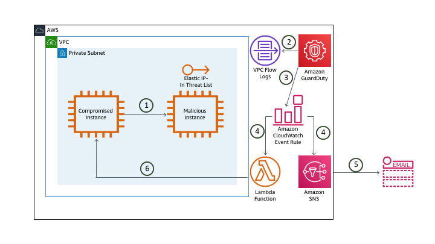
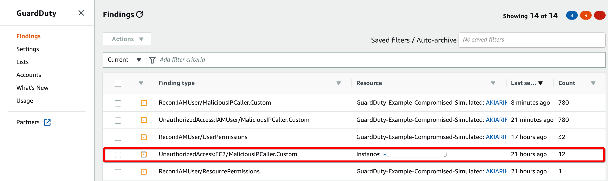
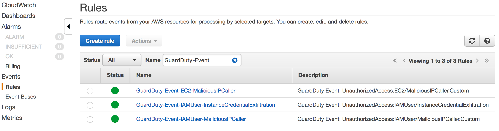
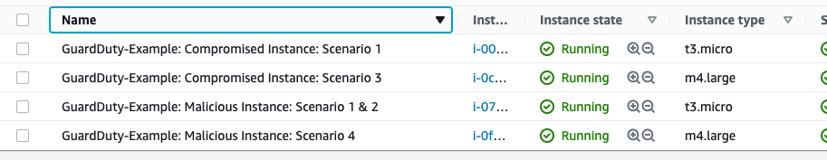

# Compromised EC2 Instance

## Scene simulation

After an uneventful yet unnecessarily long commute to work, you arrived at the office on Monday morning. You grabbed a cup of coffee, sat down in your cube, opened up your laptop and begin to go through your emails. Soon after you begin though you start receiving emails indicating that GuardDuty has detected new threats. You don’t yet know the extent of the threats but you quickly begin to investigate. Now the good news is that your coworker Alice has already set up some hooks for specific findings so that they will be automatically remediated.

The first email you receive from GuardDuty indicates that one of your EC2 instances might be compromised:

> GuardDuty Finding | ID: 1xx: The EC2 instance i-xxxxxxxxx may be compromised and should be investigated

Shortly after the first email, you receive a second email indicating that the same GuardDuty finding has been remediated:

> GuardDuty Remediation | ID: 1xx: GuardDuty discovered an EC2 instance (Instance ID: i-xxx) that is communicating outbound with an IP Address on a threat list that you uploaded.  All security groups have been removed and it has been isolated. Please follow up with any additional remediation actions.

## Architecture Overview

> 1. The **compromised instance** pings the EIP of the **malicious instance**. That EIP is in a custom threat list.
> 2. GuardDuty is monitoring the VPC Flow Logs (in addition to CloudTrail and DNS Logs) and analyzing this based on threat lists, machine learning, baselines, etc.
> 3. GuardDuty generates a finding and sends this to the GuardDuty console and CloudWatch Events.
> 4. The CloudWatch Event rule triggers an SNS topic and a Lambda function.
> 5. SNS sends you an e-mail with the finding information.
> 6. A Lambda function isolates the **compromised instance**.

When Alice setup the hook for notifications she only included certain information about the finding because she had also setup a Lambda function to automatically isolate the instance and send out the details of the remediation.  Since the finding has been remediated you decide you still want to take a closer look at the setup Alice currently has in place.

## Investigation

### Browse to the GuardDuty console to investigate

Although you can view the GuardDuty findings in the console, most customers aggregate all findings across their regions and accounts to a central security information and event management (SIEM) system for analysis and remediation.  A common approach for aggregating these findings is to setup GuardDuty in a <a href="https://docs.aws.amazon.com/guardduty/latest/ug/guardduty_accounts.html" target="_blank">Administrator/Member</a> structure and then use a workflow including CloudWatch Event Rules and Lambda Functions to push findings to your SIEM or a centralized logging framework.  There are also partner solutions that publish Lambda Function Blueprints to make it easier to consolidate findings.

1. Navigate to the <a href="https://us-west-2.console.aws.amazon.com/guardduty/home?" target="_blank">GuardDuty Console</a> (us-west-2).
> If there is nothing displayed click the refresh button.

2. A finding should show up with the type **UnauthorizedAccess:EC2/MaliciousIPCaller.Custom**.
> Based on the format you reviewed earlier can you determine the security issue by the finding type?

The quick view of the finding shows a severity symbol, the finding type, the affected resource, the last time the finding was detected, and a count of the subsequent occurrences of an existing finding.  

> Findings are available in the service for 90 days.

The finding type indicates that an EC2 instance in your environment is communicating outbound to an IP address included on a <a href="https://docs.aws.amazon.com/guardduty/latest/ug/guardduty_upload_lists.html" target="_blank">custom threat list</a>. Click on **Lists** in the left navigation to view the custom threat list Alice added.

> GuardDuty uses managed threat intelligence provided by AWS Security and third-party providers, such as ProofPoint and CrowdStike. You can expand the monitoring scope of GuardDuty by configuring it to use your own custom trusted IP lists and threat lists.  If you setup a Administrator/Member GuardDuty structure, users from the Administrator GuardDuty account can manage trusted IP lists and threats lists and they are inherited by the member accounts.  Users from the member accounts are not able to modify the lists.  

??? info "Scenario Note"
	The EC2 instance indicated by this finding is actually just connecting to an [Elastic IP](https://docs.aws.amazon.com/AWSEC2/latest/UserGuide/elastic-ip-addresses-eip.html) (EIP) on another instance in the same VPC to keep the scenario localized to your environment. The CloudFormation template automatically created the threat list and added the EIP for the malicious instance to the list.

### View the CloudWatch Event rule

Alice used CloudWatch Event Rules to send the email you received about the findings and also to take remediations steps. Examine the CloudWatch Events console to understand what Alice configured and to see how the remediation was triggered.

1.  Navigate to the <a href="https://us-west-2.console.aws.amazon.com/cloudwatch/home?" target="_blank">CloudWatch Console</a> (us-west-2) and on the left navigation, under the **Events** section, click **Rules**.

    > You will see three Rules in the list that were created by the CloudFormation template. All of these begin with the prefix “*GuardDuty-Event*."

	

2.	Click on the rule named **GuardDuty-Event-EC2-MaliciousIPCaller**.

	

Under the **Targets** section you will see two entries, one for a Lambda function and one for an SNS Topic.  The CloudWatch Event Rule publishes the finding to the SNS Topic which in turn sends out an email notification.  Rather than sending the entire JSON event you can see how Alice customized the email by using an **<a href="https://docs.aws.amazon.com/AmazonCloudWatch/latest/events/CloudWatch-Events-Input-Transformer-Tutorial.html" target="_blank">input transformer</a>**. You can use the input transformer feature of CloudWatch Events to customize the text that is taken from an event before it is input to the target of a rule.

### View the Remediation Lambda function

The Lambda function is what handles the remediation logic for this finding. Alice setup the Lambda function to remove the compromised instance from its current security group and add it to one with no ingress or egress rules so that the instance is isolated from the network. Click the **Name** for the Lambda function in the Targets section to evaluate the remediation logic.

Collapse the **Designer** tab and scroll down to view the code for this function (walking through the code logic is outside the scope of this scenario). You can also click the **Monitoring** tab and view the invocation details for this function.

> What permissions does the Lambda Function need to perform the remediation?

### Verify that the remediation was successful

Next, double check the effects of the remediation to ensure the instance is isolated.  At this point you have the instance ID of the compromised instance from the email notifications and the name of the isolation security group name from reviewing the Lambda Function code.

1.	Browse to the <a href="https://us-west-2.console.aws.amazon.com/ec2/v2" target="_blank">EC2 console</a> (us-west-2) and click **Running Instances**.

    > You should see four instances with names that begin with **GuardDuty-Example**.

    

2.  Click on the instance with the instance ID you saw in the GuardDuty finding or email notifications.

    > **GuardDuty-Example: Compromised Instance: Scenario 1**.  

3.  After reviewing the remediation Lambda Function you know that the instance should now have the Security Group with a name that includes **ForensicSecurityGroup**.  Under the **Security** tab verify the instance has this security group.

    > Initially, all four of the instances launched by the CloudFormation template were in the Security Group with a name that includes **TargetSecurityGroup**. The Lambda function removed the TargetSecurityGroup from the instance and added the ForensicsSecurityGroup to isolate the instance.

4. Click on the **ForensicSecurityGroup** and view the ingress and egress rules.

## Questions

!!! question "Which data source did GuardDuty use to identify this threat?"

!!! question "Will isolating the instance have any effect on an application running on the instance?"

!!! question "How could you add more detail to the email notifications?"
