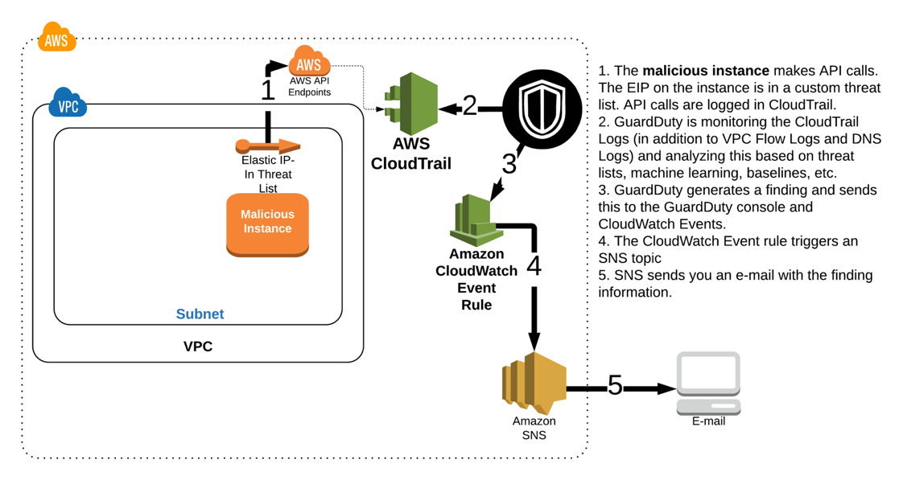
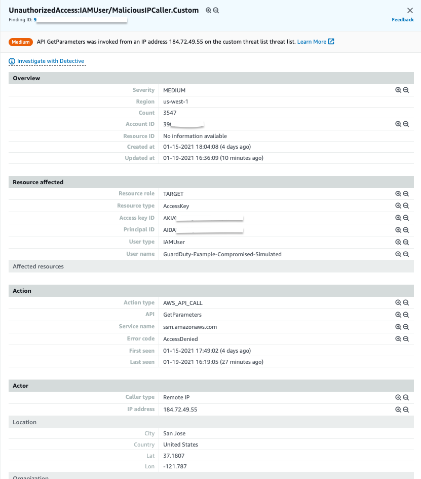

#Compromised IAM credentials (simulated)

You have completed the examination of the first attack, confirmed it was properly remediated, and then sat back to take your first sip of coffee for the day when you notice an additional email about new findings. The first of the new findings indicates that an API call was made using AWS IAM credentials from an IP address on a custom threat list.

!!! attention "None of your personal IAM credentials have actually been compromised or exposed in any way."

## Architecture Overview

> 1. The **malicious instance** makes API calls. The EIP on the instance is in a custom threat list. API calls are logged in CloudTrail
> 2. GuardDuty is monitoring the CloudTrail Logs (in addition to VPC Flow Logs and DNS Logs) and analyzing this based on threat list, machine learning, baselines, etc.
> 3. GuardDuty generates findings and sends this to the GuardDuty console and CloudWatch Events.
> 4. The CloudWatch Event rule triggers an SNS topic.
> 5. SNS sends you an e-mail with the finding information.

## Investigation

### Browse to the GuardDuty console to investigate

To view the findings:

1.  Navigate to the <a href="https://us-west-2.console.aws.amazon.com/guardduty/home?" target="_blank">GuardDuty Console</a> (us-west-2).
2.  Click the   icon to refresh the GuardDuty console. You should now see additional findings that are related to **Recon:IAMUser**, **UnauthorizedAccess:IAMUser** and **Discovery:S3**.
> Based on the format you reviewed earlier can you determine the security issues by the finding type?

3.  Click on the **UnauthorizedAccess:IAMUser/MaliciousIPCaller.Custom** finding to view the full details. You can see the finding details include information about what happened, what AWS resources were involved in the suspicious activity, when this activity took place, and other additional information.  Under **Resource Affected**, find the **User Name** associated with this finding.

	

4.  Lets see another finding, click on **Discovery:S3/MaliciousIPCaller.Custom** to view the details.

	

Just like the previous finding, you can see details about what happened and the details of the threat. In this specific case a ListObjects API call was run which is a data plane API event for S3, that is why this finding was separately categorized as a S3 discovery finding. More on S3 control plane events vs data plane events in the next section. 

These findings indicates that the IAM credentials (of the user you found above) are possibly compromised because API calls using those credentials are being made from an IP address on a custom threat list.

> What actions did this AWS IAM User take? Click on each of the findings, You can see under **Action** and then **API** that **GetParameters**, **ListObjects**, and **ListTables** API calls were made but how can you view the rest of the actions made by this user over the past hour or day?  GuardDuty is able to analyze large volumes of data and identity true threats in your environment but from an investigation and remediation stand point it is still important to correlate other data to understand the full scope of the threat.  In this case an analyst would use the details in this finding to pinpoint historical user activity in CloudTrail. AWS also has a threat hunting tool called Detective that can help with further investigation.

??? info "Scenario Note"
	These IAM findings are being generated by the “malicious EC2” instance making API calls. These API calls generate findings because the EIP of that instance is in a custom threat list.

### View the CloudWatch Event rule

1.	Navigate to the <a href="https://us-west-2.console.aws.amazon.com/cloudwatch/home?" target="_blank">CloudWatch console</a> and on the left navigation, under the **Events** section, click **Rules**.
2.	Click on the rule that Alice configured for this particular finding (**GuardDuty-Event-IAMUser-MaliciousIPCaller**).
3.	Under the **Targets** section, you will see a rule for an SNS Topic. Turns out Alice did not set up a Lambda function to remediate this threat because the decision by the security team was to manually investigate and remediate this particular type of finding.

> Since GuardDuty integrates with CloudWatch Events you have the flexibility to put in place full or partial automated remediation workflows.  These could be custom Lambda Functions that you build out or maybe even <a href="https://aws.amazon.com/guardduty/resources/partners/" target="_blank">partner</a> solutions.  You can also configure other AWS Resources as targets in your CloudWatch Event Rules such as SSM Run Commands or Step Functions state machines. For some finding types you may choose to have only notification workflows and require manual remediation steps. As you design these workflows it is important to evaluate the workloads running in your environments to see what effects a remediation could have. 

### Manually remediate the finding

Since Alice did not setup a remediation for this finding, you have to manually remediate this.  While the security team is analyzing the previous activity of this user to better understand the scope of the compromise, you need to disable the access key associated with the user to prevent any more unauthorized actions.

1.  Browse to the <a href="https://console.aws.amazon.com/iam/home?region=us-west-2" target="_blank">AWS IAM</a> console.
2.  Click **Users** in the left navigation.
3.  Click on the user you identified in the GuardDuty finding and email notifications (**GuardDuty-Example-Compromised-Simulated**).
4.  Click the **Security Credentials** tab.
5.  Under **Access Keys**, find the Access Key ID you identified in the finding and click **Make Inactive**.

## Questions

!!! question "Which data source did GuardDuty use to identity this threat?"

!!! question "What permissions did the user have?"

!!! question "Why would the security team decide against setting up an automated remediation?"
