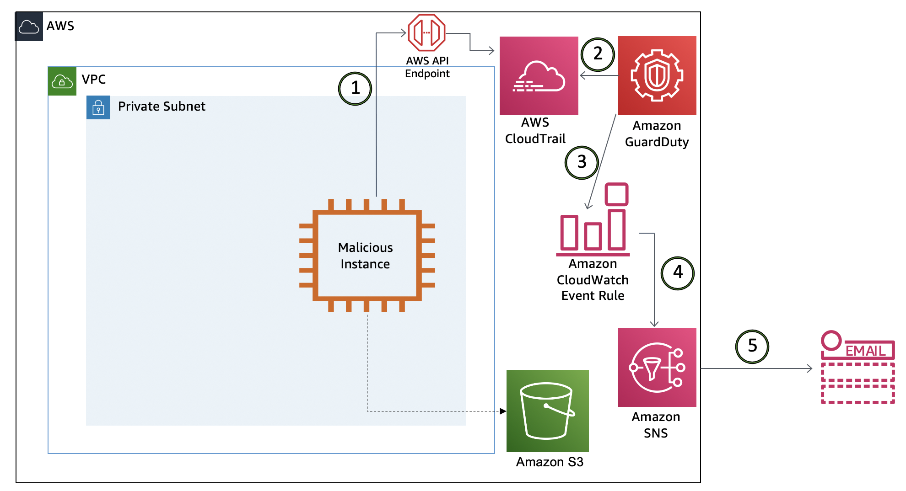

#Compromised IAM credentials (simulated)

You were already having a rough morning, you just finished your coffee and see a few more findings related to S3 in the GuardDuty console. These are different from the the previously seen IAM and EC2 findings.

!!! attention "None of your personal IAM credentials have actually been compromised or exposed in any way."

## Architecture Overview

> 1. The **malicious instance** makes API calls. API calls are logged in CloudTrail
> 2. GuardDuty is monitoring the CloudTrail Logs (in addition to VPC Flow Logs and DNS Logs) and analyzing this based on threat list, machine learning, baselines, etc.
> 3. GuardDuty generates findings and sends this to the GuardDuty console and CloudWatch Events.
> 4. The CloudWatch Event rule triggers an SNS topic.
> 5. SNS sends you an e-mail with the finding information.

## Investigation

### Browse to the GuardDuty console to investigate

To view the findings:

1.  Navigate to the <a href="https://us-west-2.console.aws.amazon.com/guardduty/home?" target="_blank">GuardDuty Console</a> (us-west-2).
2.  Click the   icon to refresh the GuardDuty console. You should now see additional findings that are related to **Stealth:S3** and **Policy:S3**.
> Based on the format you reviewed earlier can you determine the security issues by the finding type?

3.  Click on the **Stealth:S3/ServerAccessLoggingDisabled** finding to view the full details. You can see the finding details include information about what happened, what AWS resources were involved in the suspicious activity, when this activity took place, and other additional information.  Under **Resource Affected**, find the **S3 bucket** associated with this finding.

	

	This finding informs you that S3 server access logging is disabled for a bucket within your AWS environment. If disabled, no logs are created for any actions taken on the identified S3 bucket or on the objects in the bucket, unless S3 object level logging is enabled for this bucket. Disabling logging is a technique used by unauthorized users in order to cover their tracks. To learn more, see S3 <a href="https://docs.aws.amazon.com/AmazonS3/latest/dev/ServerLogs.html" target="_blank">Server Access Logging</a>. Disabling logging is generally viewed as a tactic used to cover tracks. That is why it is important to investigate this finding. 

4. Lets look at another one, click on **Policy:S3/BucketBlockPublicAccessDisabled**. This finding is generated when block public access settings are disabled, if they were previously enabled. This could be a legit activity or an innocent user could have accidentally changed the bucket settings. In such a situation it is always good to confirm with the bucket owner if this was an expected condition. But given the context of what is going on with this bucket where we also saw bucket logging being disabled, this seems more suspicious. 

 
> What actions did this IAM User take? Click on each of the findings, You can see under **Action** and then **API** the API calls were made.  GuardDuty is able to analyze large volumes of data and identity true threats in your environment but from an investigation and remediation stand point it is still important to correlate other data to understand the full scope of the threat.  In this case an analyst would use the details in this finding to pinpoint historical user activity in CloudTrail. AWS also has a investigation tool called <a href="https://aws.amazon.com/detective/" target="_blank">Amazon Detective</a> that can help with further investigation and analyze the root cause of security issue.

??? info "Scenario Note"
	These IAM findings are being generated by the “malicious EC2” instance making API calls. These API calls generate findings because GuardDuty is looking for such API activity that can disable S3 logging and S3 block public access setttings.
	
!!! attention "The bucket has not been exposed in any way, if you go to the S3 console the public block settings at the account level are still enabled."
	
### View the CloudWatch Event rule

1.	Navigate to the <a href="https://us-west-2.console.aws.amazon.com/cloudwatch/home?" target="_blank">CloudWatch console</a> and on the left navigation, under the **Events** section, click **Rules**.
2.	Click on the rule that Alice configured for this particular finding (**GuardDuty-Event-S3-Stealth-Policy**).
3.	Under the **Targets** section, you will see a rule for an SNS Topic. Turns out Alice did not set up a Lambda function to remediate this threat either because the team is investigating using <a href="https://docs.aws.amazon.com/config/latest/developerguide/managed-rules-by-aws-config.html" target="_blank">AWS Config managed rules</a> to autoremediate such findings. 
4. Observe the input transformer, how would you modify this setting to get any additional data you need in the SNS email ?

> GuardDuty can also sends its finding to Security Hub (if enabled) which helps aggregate findings from different AWS services as well as partner services. Security hub can then be used to take <a href="https://docs.aws.amazon.com/securityhub/latest/userguide/securityhub-cwe-custom-actions.html" target="_blank">custom actions</a> on these findings by using CloudWatch Event rules to send the findings to ticketing, chat, Security Information and Event Management (SIEM), Security Orchestration Automation and Response (SOAR), and incident management tools or to custom remediation playbooks.

### Manually remediate S3 bucket

Since the bucket settings were changed you confirmed with the bucket owner that those changes need to reverted back.

1.  Browse to the <a href="https://s3.console.aws.amazon.com/s3/home?region=us-west-2" target="_blank">AWS S3</a> console.
2.  Click **guardduty-example-finance** bucket in the bucket list.
3.  Click on the **properties** tab, scroll down to **Server Access Logging**, and click **Edit**, then **Enable**.
4.  Now click **Browse S3** button and select the **guardduty-example-log** and click **choose path**.
5.  Finally click **Save changes** button and you have enabled server access logging. 
6.  For making the bucket private again, click on the **Permissions** tab, and edit the **Block public access (bucket setting)**
7.  Check **Block all public access** box, then click **Save changes** and type 'confirm' in the dialogue box that appears. Now you have made the bucket private again.

### Manually remediate the compromised IAM user through which the bucket settings were changed. 

While the security team is analyzing the previous activity of this user to better understand the scope of the compromise, you need to disable the access key associated with the user to prevent any more unauthorized actions just like you did in "Compromised IAM Credentials" Scenario.  

1.  Browse to the <a href="https://console.aws.amazon.com/iam/home?region=us-west-2" target="_blank">AWS IAM</a> console.
2.  Click **Users** in the left navigation.
3.  Click on the user you identified in the GuardDuty finding and email notifications (**GuardDuty-Example-Compromised2-Simulated**).
4.  Click the **Security Credentials** tab.
5.  Under **Access Keys**, find the Access Key ID you identified in the finding and click **Make Inactive**.

## Questions

!!! question "Which data source did GuardDuty use to identity this threat?"

!!! question "Was the bucket actually exposed to the Internet?"

!!! question "Why is the severity of both these findings 'Low'?"

!!! question "How would you protect unauthorized access of Access Keys?"
